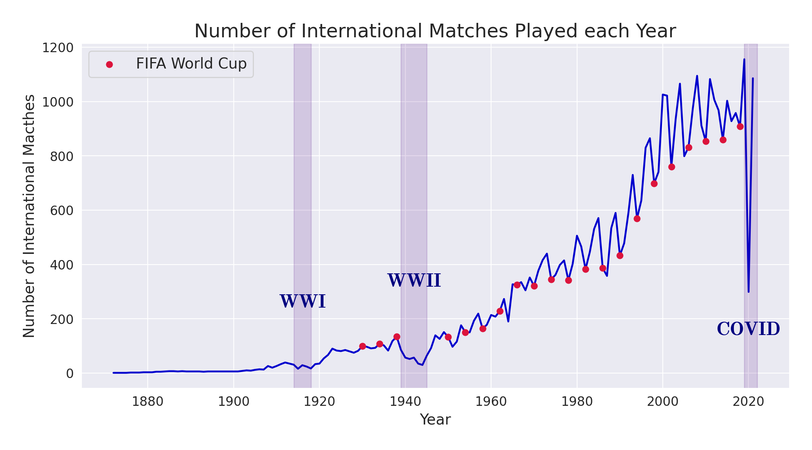
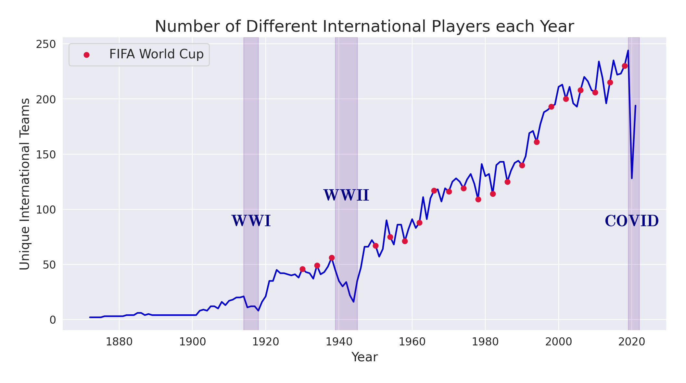
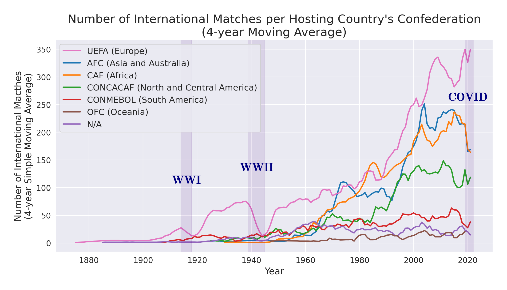
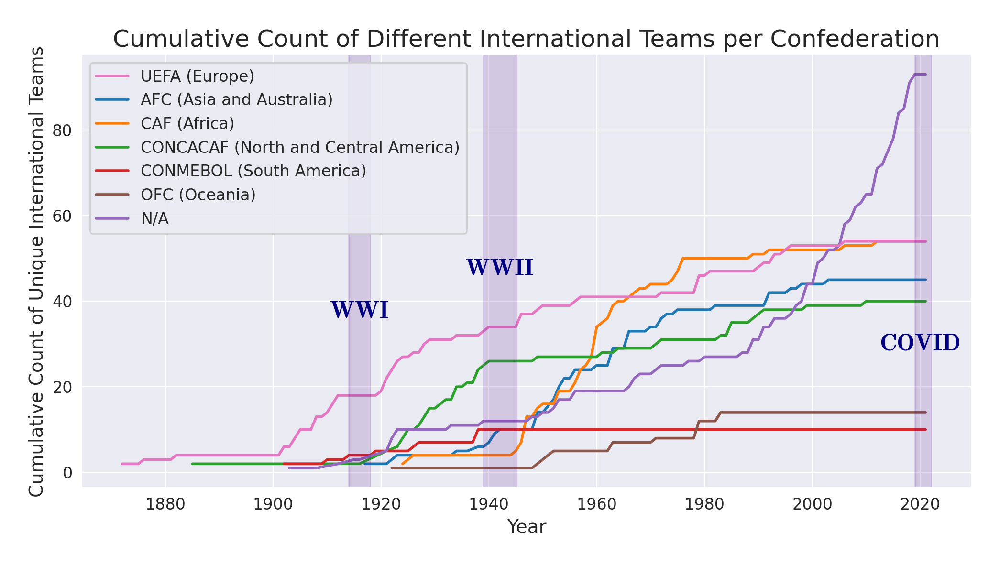
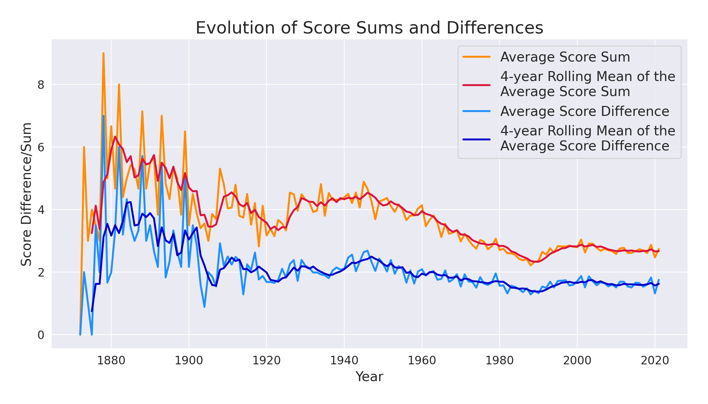
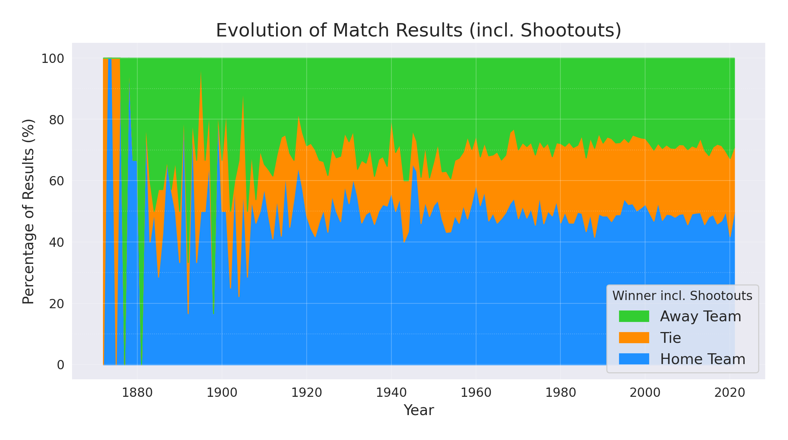

# How has Football changed over the last 150 years?

**An analysis of the evolution of football based on international matches data from the past 150 years.**

## Introduction

It is no secret that football is the world’s most popular sport. Billions of fans watch football matches on a regular basis and over 250 million people of all ages and cultures play the sport in more than 200 countries around the globe \[[source](https://www.allianz.com/en/about-us/sports-culture/football/allianz-football.html)\]. However, despite its tremendous popularity nowadays, football has come a long way from its origins as a rugby spin-off in mid-19th-century England to the most global and celebrated sport in the world.

So how has football grown over time? Was the growth similar in all continents? Has the playing style changed throughout the years? To answer these questions, I analyzed international football results from 1872 to 2021, using an up-to-date dataset of over 40,000 international football matches [publicly available on Kaggle](https://www.kaggle.com/datasets/martj42/international-football-results-from-1872-to-2017). I share my findings in the next sections.

## 1. Football Growth

The graphs below show the number of international matches and the number of different teams that played each year since 1872. As you can see, the number of matches and teams has steadily increased over the years, except during the World Wars and the COVID pandemic, where there are significant drops in the numbers of matches and teams.

Also, we can see periodic spikes and drops on both graphs every 4 years, especially in the last 50 years. The reason for that is the FIFA World Cup events, which happen every 4 years, as marked in red dots on the graphs. The years prior to the World Cup are filled with World Cup qualification matches involving all countries, which doesn’t happen in the years of World Cup events—in which only 32 countries participate. Therefore, the numbers of international matches and teams significantly decrease in World Cup years.

  
  &nbsp
  

## 2. Football Growth per Hosting Confederation

The first graph below shows a 4-year moving average of the number of international matches per hosting country’s confederation. As you can see, European countries hosted the most matches throughout all the years, with brief exceptions in the 70s and 80s. This makes sense, as football originated in Europe and UEFA is one of the confederations with most countries. Besides that, we can see the beginning of a stagnation trend in the number of matches in the last 15 years, which is likely due to the standardization of international tournaments and friendly matches’ calendars across different locations.

The second graph displays the cumulative count of different countries in each confederation over the years. Confederations from Europe (UEFA) and America (CONMEBOL and CONCACAF) were the first to grow, but by the end of the 80s, virtually all confederations were established and structured with respect to their members. Additionally, despite accounting for a much lower number of matches, many football teams that do not belong to any FIFA confederation (marked as ‘N/A’) also started participating in international matches, with most new players joining in the last 25 years, such as Iraqi Kurdistan, Somaliland, and Crimea.

  
  &nbsp
  

## 3. Playing Style Evolution

Lastly, I wanted to analyze how the playing style changed over the years. The first graph shows the average sums and differences between home and away teams’ scores, and the corresponding 4-year rolling means. As it can be observed, both curves showed a decreasing trend over time, especially in the last 80 years, indicating that fewer goals are scored per match now than before. Such a trend can be attributed to the professionalization of the sport, which increased the overall competitiveness and resulted in more balanced tournaments.

The last graph shows how the proportion of each possible match result evolved over time, including the shootout outcome (which happened in less than 1% of the analyzed matches). Surprisingly, the proportion of results remained fairly stable in the last 100 years, with just a slight increase in ties more recently. So ever since 1920, home teams win about half the time, while away teams win in about 30% of the matches and ties happen in the remaining 20%, which shows the significance of the home-court advantage. Finally, as winning rates remained the same even though score differences decreased, we can conclude that winning score margins got slimmer in recent years. After all, a win is a win, regardless of how many more goals the winning team scored

  
  &nbsp
  

## Conclusion

In this analysis, we looked at how football has evolved as a sport in the past 150 years. We analyzed the number of matches and teams to see how football has grown to become the world’s most popular and celebrated sport, both globally and also in each confederation region. We also looked at the evolution of score sums and differences and the evolution of match results to understand how the playing style evolved over time, relating the findings with the professionalization of the sport and the increased competitiveness of international tournaments. Finally, I hope this analysis can inspire the readers to explore different topics using data and make them as excited as I am about this beautiful sport named football.